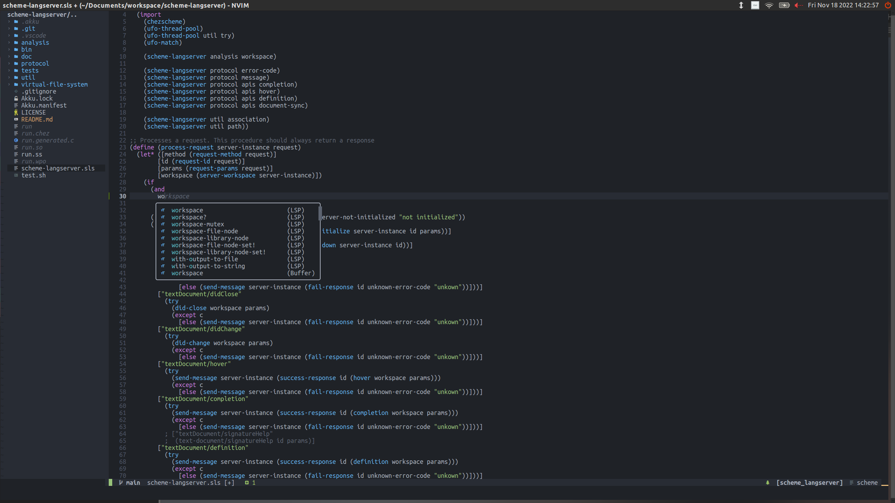
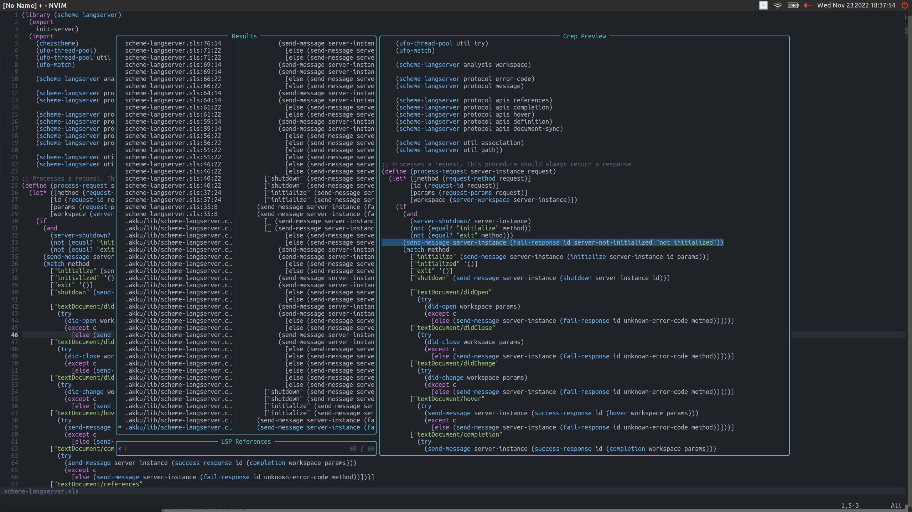
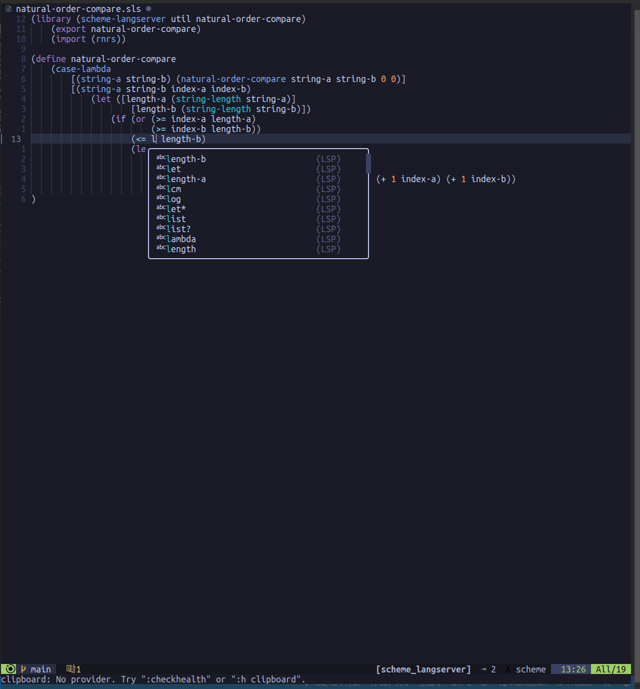

# Scheme-langserver
>NOTE: There're many many bugs in scheme-langserver. I'm just fixing and appealing help from the community. Please be patient.

>NOTE: you can find the auto generated type information [here](https://ufo5260987423.github.io/scheme-langserver/doc/analysis/type-inference-result). It's now mainly used for next-stage-development (maybe include AKKU) and debugging.

Implementing support like autocomplete, goto definition, or documentation on hover is a significant effort for programming. However, comparing to other language like java, python, javascript and c, language server protocol implementation for lisp language are just made in a vacuum. [Geiser](https://gitlab.com/emacs-geiser), [racket langserver](https://github.com/jeapostrophe/racket-langserver) and [swish-lint](https://github.com/becls/swish-lint) etc., their works are all based on `repl`(Read-Eval-Print Loop) or keyword tokenizer instead of programming. For example, if a programmer was coding on an unaccomplished project, in which the codes were not fully executable, [Geiser](https://gitlab.com/emacs-geiser) or any others would only complete top-level binding identifiers listed by `environment-symbols` procedure (for [Chez](https://cisco.github.io/ChezScheme/)), or complete symbols instead of identifiers. Which means for local bindings and unaccomplished codes, though making effort for programming is supposed of the importance mostly, [Geiser](https://gitlab.com/emacs-geiser) and its counterparts help nothing on recognizing identifier's valid scope. Familiar cases occur with goto definition and many other functionalities.

A primary cause is, for scheme and other lisp dialects, their abundant data sets and flexible control structures raise program analysis a big challenge. Especially the macro, it seems like that scheme is mainly used for genius and meta/macro programming. But I say no. Scheme can make many interesting things if a better programming environment is provided. And now you may [startup here](./doc/startup.md).

This package is a language server protocol implementation helping scheme programming. It provides completion, definition and type inference. These functionalities are established on static code analysis with [r6rs standard](http://www.r6rs.org/) and some obvious rules for unaccomplished codes. This package itself and related libraries are published or going to be published with [Akku](https://akkuscm.org/), which is a package manager for Scheme. 

This package also has been tested with [Chez Scheme](https://cisco.github.io/ChezScheme/) versions 9.4 and 9.5. A detailed test on version 10.0.0 will be done after upgrading my laptop OS to a newer version.

I do this open source work just in my spare time and I can contribute many splendid ideas to the community like embedding data flow analysis into scheme-langserver or many other things. And I'm continuously asking for much more donation or funding. You can click [this patreon page](https://www.patreon.com/PoorProgrammer/membership) or [爱发电](https://afdian.net/a/ufo5260987423) to donate monthly, or just donate 10 USD just once time with the following paypal link. 

[](https://www.paypal.com/paypalme/ufo5260987423/10)

## Recent Status
I'll keep fixing bugs, profiling the code, and collecting information for my giant book on homemade type inference system. This will take me about 1 years. Further developments including a [VScode](https://code.visualstudio.com/) plugin and data flow analysis. But actually, I'm now setting this open source work a part-time job, and I can not guarantee a schedule.

## Release 
1.2.2 I just fixed some bugs processing my own other projects. 

Previous releases please refer to [this file](./doc/release-log.md).

### Features
1. Top-level and local identifiers binding completion.

2. Goto definition.

3. Compatible with package manager: Akku.
4. File changes synchronizing and corresponding index changing.
5. Hover.
6. References and document highlight (document-scoped references).

7. Document symbol.

8. Catching *-syntax(define-syntax, let-syntax, etc.) based local identifier binding. 
9. Cross-platform parallel indexing.
10. Self-made source code annotator to be compatible with .sps files.
11. Peephole optimization for API requests.
12. Type inference with a homemade DSL interpreter(I'm very proud of it!). And now it has been embedded into the auto-completion. As the following figure indicated, the "length-b" and "length-a" having "integer?" type are in the front of those recommended options because they can match the parameter type requiring from "<=". 

A test in can prove this result, just run `scheme --script tests/protocol/apis/test-completion.sps` and the log file `scheme-langserver.log` would contain results like this:
```bash
send-message
2023 11 21 11 26 41 967266866
{"jsonrpc":"2.0","id":"3","result":[{"label":"length-a"},{"label":"length-b"},{"label":"lambda"},{"label":"latin-1-codec"},{"label":"lcm"},{"label":"least-fixnum"},{"label":"length"},{"label":"let"},{"label":"let*"},{"label":"let*-values"},{"label":"let-syntax"},{"label":"let-values"},{"label":"letrec"},{"label":"letrec*"},{"label":"letrec-syntax"},{"label":"lexical-violation?"},{"label":"list"},{"label":"list->string"},{"label":"list->vector"},{"label":"list-ref"},{"label":"list-sort"},{"label":"list-tail"},{"label":"list?"},{"label":"log"},{"label":"lookahead-char"},{"label":"lookahead-u8"}]}
```
13. Abstract interpreter for identifier catching among different file extensions like scm, ss, sps, sls and sld.

### TODOs
14. Renaming. 
15. Fully compatible with [r6rs standard](http://www.r6rs.org/).
16. Macro expanding.
17. Code eval.
18. Code diagnostic.
19. Add cross-language semantic supporting. Well, would java, c, python and many other languages can be supported with an AST transformer?
20. Extract expression/statements into a procedure()

## TODO:Contributing 

## Debug

### How to Debug
https://www.scheme.com/debug/debug.html#g1

### Output Log
Following tips from [Building](#building), [Installation for Lunar Vim](#installation-for-lunarvim) and [Installation for VScode](#todo-installation-for-vscode), if anyone wants to do some developing and log something, it will be convenient to add `path-to-log-file` and re-write file `~/.local/share/lunarvim/site/pack/packer/start/nvim-lspconfig/lua/lspconfig/server_configurations/scheme_langserver.lua` as follows:
```lua
local util = require 'lspconfig.util'
local bin_name = '{path-to-run}'
local cmd = { bin_name ,"path-to-log-file"}

return {
  default_config = {
    cmd = cmd,
    filetypes = { 'scheme' },
    root_dir = util.find_git_ancestor,
    single_file_support = true,
  },
  docs = {
    description = [[
https://github.com/ufo5260987423/scheme-langserver
`scheme-langserver`, a language server protocol implementation for scheme
]]   ,
  },
}
```
### Recurring with Log 
With above [output log](#output-log), you may use `tests/log-debug.sps` recurring bugs:
1. Rename `{path-to-log}`(usually `~/scheme-langserver.log`) as `~/ready-for-analyse.log`;
2. run `scheme --script tests/log-debug.sps`. If you want to re-produce the multi-thread environment, it would also be available to run `scheme --script tests/log-debug.sps`.

## Test
Almost all key procedures and APIs are tested. My work is just so rough but useful, maybe you would like to find what I've done in `tests` directory or just run following command in `{scheme-langserver-root-directory}`
``` bash
bash test.sh
```
>NOTE
It's hard to do test with threaded environment. So, current tests focus on single thread.

## Use Scheme-langserver for Other Purpose
### Script-Fu in GIMP
Script-Fu is based on an interpreted language called Scheme, and works by using functions that interact with GIMP's internal functions. Taking [this page](https://dalelane.co.uk/blog/?p=628)'s script as an example, you can apply scheme-langserver with script file with "SCM" extension.

### Others

Well, I'm also interested in [OMN (Opusmodus Notation)](https://opusmodus.com/) and AutoLisp. But I still have many things to do.

## Code Count
```bash
find . -name "*.sls" ! -path "./.akku/*" |xargs wc -l
```
## Detailed Document
1. [Catching identifier bindings](./doc/analysis/identifier.md)
2. [Synchronizing](./doc/util/synchronize.md)
3. [Type inference](./doc/analysis/type-inference.md),~~[类型推断](./doc/analysis/type-inference.cn.md)~~(Deprecated, and I'm writing a Chinese book for it)
4. [API Analysis](./doc/protocol/analysis.md)

## Star History

[](https://star-history.com/#ufo5260987423/scheme-langserver)

## Contributors

