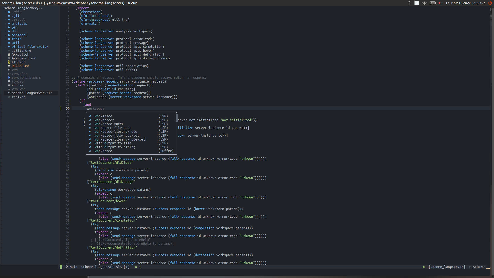
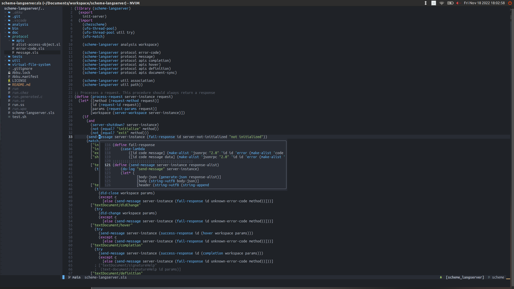
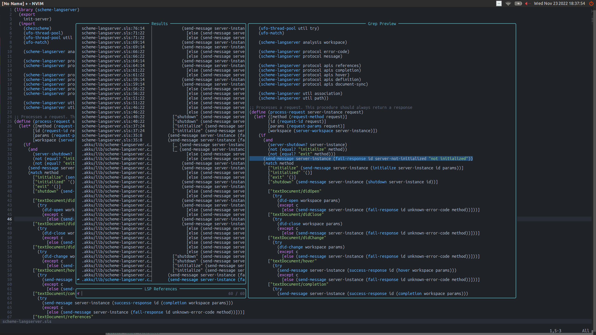
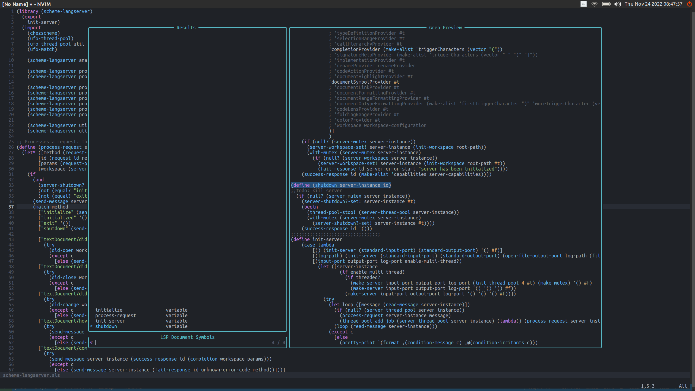
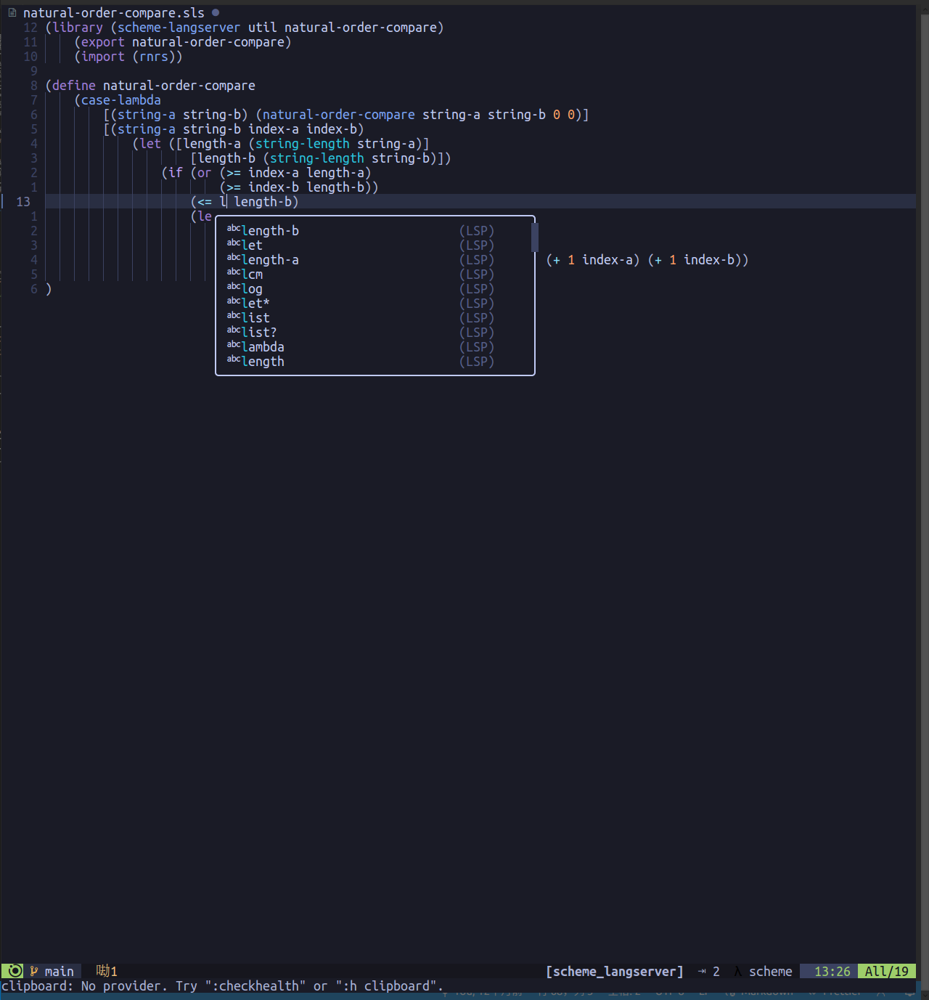
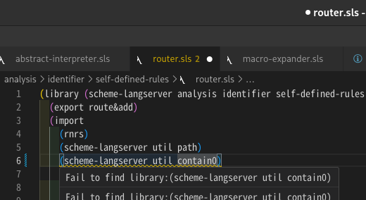

# Scheme-langserver

[](https://deepwiki.com/ufo5260987423/scheme-langserver)

You may read my [paper](./doc/paper.pdf) and cite like this:

> WANG, Z. (2025, May 12). Scheme-langserver: Treat Scheme Code Editing as the First-Class Concern. The 18th European Lisp Symposium (ELS`25), Zurich. https://doi.org/10.5281/zenodo.15384882

Due to occasional GitHub access restrictions from China, this repository is also mirrored on [Codeberg](https://codeberg.org/ufo5260987423/scheme-langserver) and [Gitee](https://gitee.com/ufo5260987423/scheme-langserver). I collaborate with [XmacsLabs](https://github.com/XmacsLabs); a fork is available [here](https://github.com/XmacsLabs/scheme-langserver).

<video src="https://github.com/user-attachments/assets/893bba98-6709-4fac-a4d3-dc7b6aab46fb" controls="controls" width="500" height="300"></video>

**VSCode is now supported!** See the [setup guide](./doc/startup.md).

> **Note:** Auto-generated type information is available [here](https://ufo5260987423.github.io/scheme-langserver/doc/analysis/type-inference-result). It is mainly used for downstream development and debugging.

Implementing IDE features like autocomplete, goto definition, and hover documentation is a significant effort. Compared to languages like Java, Python, JavaScript, or C, language server implementations for Lisp dialects are still scarce. Existing tools such as [Geiser](https://gitlab.com/emacs-geiser), [racket langserver](https://github.com/jeapostrophe/racket-langserver), and [swish-lint](https://github.com/becls/swish-lint) rely primarily on a REPL or keyword tokenization rather than static program analysis.

For example, when editing an incomplete project whose code is not yet fully executable, Geiser can only complete top-level bindings listed by `environment-symbols` (on Chez Scheme) or raw symbols—not true identifiers. This means local bindings and unfinished code receive no help in recognizing valid identifier scopes. The same limitation applies to goto definition and other core IDE features.

The root cause is that Scheme and other Lisp dialects present a formidable challenge for program analysis: their rich data structures, flexible control flow, and especially macros make static reasoning difficult. But this does not mean Scheme is only for geniuses and meta-programming. With a better editing environment, Scheme can be accessible and productive for everyone.

**scheme-langserver** is a Language Server Protocol (LSP) implementation for Scheme that provides completion, goto definition, hover, and type inference through static code analysis based on the [R6RS standard](http://www.r6rs.org/). It handles incomplete code gracefully and is published via [Akku](https://akkuscm.org/), a Scheme package manager.

The server has been tested on [Chez Scheme](https://cisco.github.io/ChezScheme/) 9.4 and 9.5.

## Compilation, Installation & Configuration
See the [setup guide](./doc/startup.md).

## Debugging
For troubleshooting tips, see [how-to-debug.md](./doc/how-to-debug.md).

## Recent Status
Active development is focused on bug fixes, performance profiling, and expanding the type inference system. Planned features include a dedicated [VSCode](https://code.visualstudio.com/) plugin and data-flow analysis.

## Release
2.0.3 Fixed pretty-print bugs that were mixed with standard I/O.

Previous releases: see [release-log.md](./doc/release-log.md).

### Features
1. Completion for top-level and local identifier bindings.

2. Goto definition.

3. Compatible with package manager: Akku.
4. File-change synchronization with corresponding index updates.
5. Hover.
6. References and document highlights (document-scoped).

7. Document symbol.

8. Catching local identifier bindings in `define-syntax`, `let-syntax`, and other macro forms.
9. Cross-platform parallel indexing.
10. Custom source-code annotator compatible with `.sps` files.
11. Peephole optimization for API requests using suspendable tasks.
12. Type inference via a homemade DSL interpreter, now integrated into auto-completion. Parameters whose types match the expected signature are ranked higher, as shown below where `length-a` and `length-b` (both `integer?`) appear first because they match the parameter type required by `<=`.

13. Supports R6RS, R7RS, and [S7](https://ccrma.stanford.edu/software/snd/snd/s7.html) by switching top environments.

```bash
send-message
2023 11 21 11 26 41 967266866
{"jsonrpc":"2.0","id":"3","result":[{"label":"length-a"},{"label":"length-b"},{"label":"lambda"},{"label":"latin-1-codec"},{"label":"lcm"},{"label":"least-fixnum"},{"label":"length"},{"label":"let"},{"label":"let*"},{"label":"let*-values"},{"label":"let-syntax"},{"label":"let-values"},{"label":"letrec"},{"label":"letrec*"},{"label":"letrec-syntax"},{"label":"lexical-violation?"},{"label":"list"},{"label":"list->string"},{"label":"list->vector"},{"label":"list-ref"},{"label":"list-sort"},{"label":"list-tail"},{"label":"list?"},{"label":"log"},{"label":"lookahead-char"},{"label":"lookahead-u8"}]}
```
14. Abstract interpreter that resolves identifiers across multiple file extensions: `.scm`, `.ss`, `.sps`, `.sls`, `.sld`.
15. Code diagnostics. Currently supports detecting library-not-found errors.


### Roadmap
16. Renaming support.
17. Full R6RS compatibility.
18. Step-by-step macro expander for self-defined macros.
19. Code evaluation within the language server.
20. Cross-language semantic support via AST transformers.
21. Extract expression/statement into a procedure (refactoring).

## Contributing
Pull requests are welcome! Please see [AGENTS.md](./AGENTS.md) for project conventions, build steps, and coding style before opening a PR.

## Testing
Almost all key procedures and APIs are covered by tests. Run the full suite with:
```bash
bash test.sh
```
For faster feedback during development, run a single test file:
```bash
source .akku/bin/activate
scheme --script tests/protocol/apis/test-definition.sps
```
> **Note:** Tests currently focus on single-threaded execution.

## Other Use Cases
### Script-Fu in GIMP
Script-Fu is based on Scheme. Using [this example](https://dalelane.co.uk/blog/?p=628), you can apply scheme-langserver to `.scm` files in GIMP.

### Other Potential Targets

Possible future targets include [OMN (Opusmodus Notation)](https://opusmodus.com/) and AutoLisp.

## Code Count
```bash
find . -name "*.sls" ! -path "./.akku/*" |xargs wc -l
```
## Detailed Document
1. [Scheme-langserver: Treat Scheme Code Editing as the First-Class Concern](./doc/paper.pdf).
2. [Catching identifier bindings](./doc/analysis/identifier.md)
3. [Synchronizing](./doc/util/synchronize.md)
4. [Type inference](./doc/analysis/type-inference.md) (the Chinese version is deprecated and being rewritten into a book)
5. [API Analysis](./doc/protocol/analysis.md)
6. [Deepwiki](https://deepwiki.com/ufo5260987423/scheme-langserver)
7. [Scheme-langserver Development Guide](./doc/Scheme-langserver%20development%20guide%20en.md).

## License
[MIT](./LICENSE)

## Star History

[](https://star-history.com/#ufo5260987423/scheme-langserver)

## Contributors

