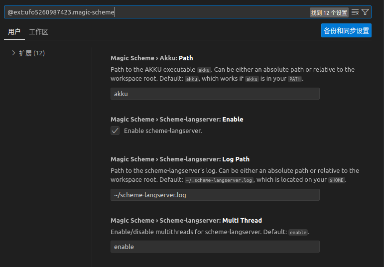

## How to Debug

Please read the followings in order.

### I don't know what went wrong!

#### Enable Log(In Magic Scheme)
As shown in this figure, you may find `Magic Scheme > Scheme-langserver: Log Path`, and please give it an available path, so that you may know what scheme-langserver did wrong.


#### Enable Log(Lunar Vim)

It's convenient to add `path-to-log-file` and re-write file `~/.local/share/lunarvim/site/pack/packer/start/nvim-lspconfig/lua/lspconfig/server_configurations/scheme_langserver.lua` as follows:
```lua
local util = require 'lspconfig.util'
local bin_name = '{path-to-run}'
local cmd = { bin_name ,"path-to-log-file"}

return {
  default_config = {
    cmd = cmd,
    filetypes = { 'scheme' },
    root_dir = util.find_git_ancestor,
    single_file_support = true,
  },
  docs = {
    description = [[
https://github.com/ufo5260987423/scheme-langserver
`scheme-langserver`, a language server protocol implementation for scheme
]]   ,
  },
}
```

### Analyse Log 

No matter who you are, for example an expert or a new schemer, if you want to debug scheme-langserver or issue a bug to the community, you will firstly analyse log.

#### Issue A Bug

Ok, you can make an issue [here](https://github.com/ufo5260987423/scheme-langserver/issues), **AND DON'T FORGET **

1. Describe what's wrong.
2. Attach your log and project, so that the community can do detailed analysis.
3. Wait.

#### Debug

If you're an expert, you may recur the bug with log `{path-to-log}` and `log-debug.sps`. 

1. You should have scheme-langserver's source in `{path-to-scheme-langserver}` and you can find out `{path-to-scheme-langserver/tests/log-debug.sps}`;
2. Rename `{path-to-log}`, usually `~/scheme-langserver.log`, as `~/ready-for-analyse.log`;
> If your log is not `~/ready-for-analyse.log`, you should do few modification to `{path-to-scheme-langserver/tests/log-debug.sps}`
3. Run 
```bash
cd {path-to-scheme-langserver}
scheme --script tests/log-debug.sps
```
or run `log-debug.sps` in Scheme REPL. Mostly bugs will cause exceptions on screen.

If you're an old-fashiond schemer, you may find [this page](https://www.scheme.com/debug/debug.html#g1) helpful. But personally I use `pretty-print` to print useful informations.

#### A Better Bug Issue

OK, you may locate which your behavior cause crash or any other wrong, and reduce the size of code and log. And finally attach them in the issue.