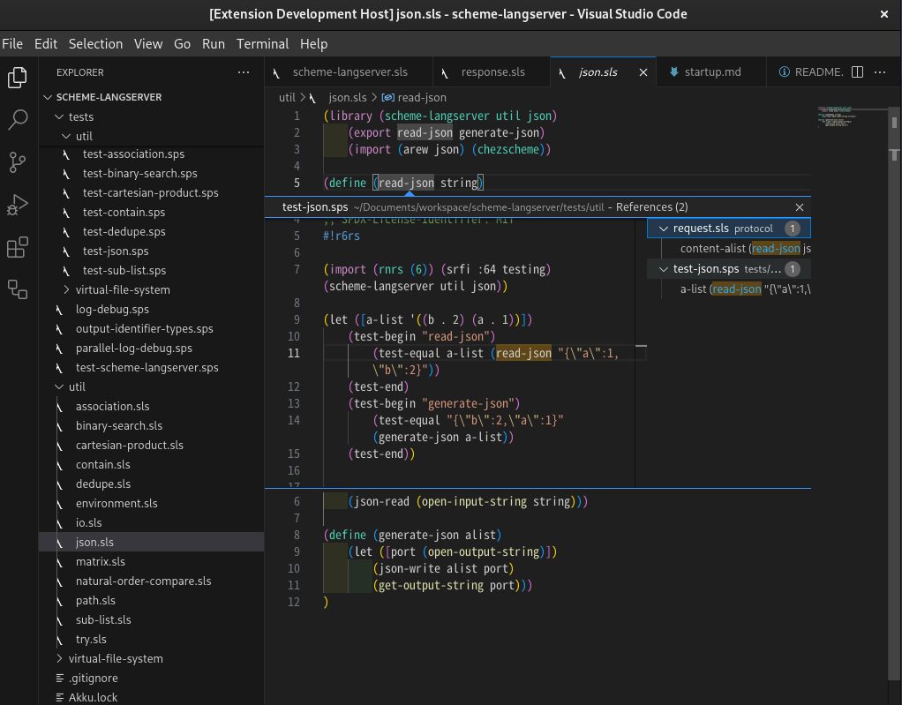
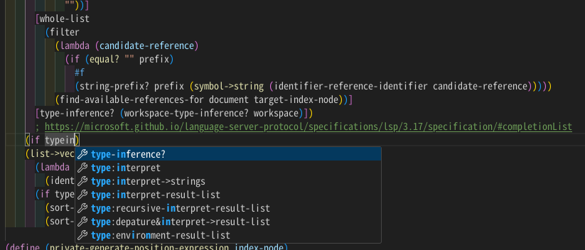
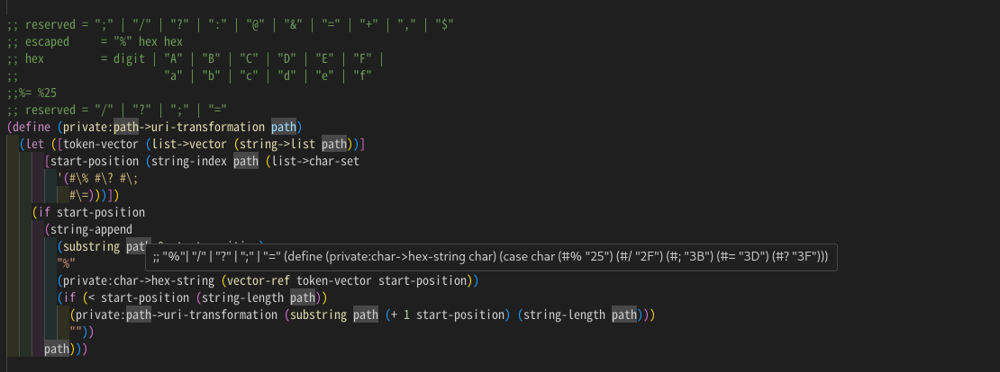
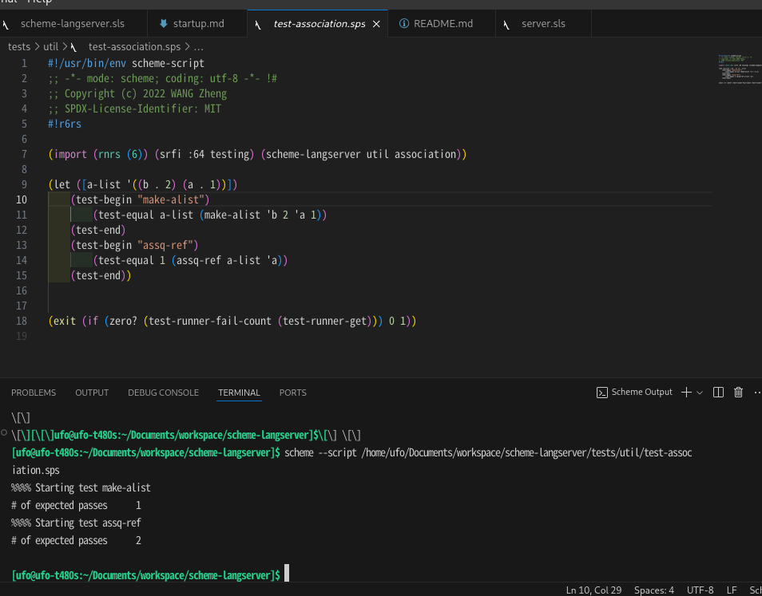

## Get Executable File 

if you're using x64-based linux operating system, you can directly download latest executable file [here](https://github.com/ufo5260987423/scheme-langserver/releases/latest/download/run),  ignore [next section](#manually-build--compile) and configure scheme-langserver with you editor [here](#configuration-for-editors).

## Configuration for Editors

### [VScode](https://code.visualstudio.com/)+[Magic Scheme](https://github.com/ufo5260987423/magic-scheme)

Magic Scheme is an VScode extension supporting Scheme(r6rs standard). With the help of [scheme-langserver](https://github.com/ufo5260987423/scheme-langserver), we're proud to say that Magic Scheme is **much better** than many counterparts, which includes even Racket extensions.

- Find references/Goto Definition


- Auto completion 


- Hover 


- Run Scheme Script



### [LunarVim(1.4)](https://www.lunarvim.org/)
Personally, I use [LunarVim(1.4)](https://www.lunarvim.org/) as an out-of-box IDE layer. So, you may configure `~/.config/lvim/config.lua` and add following codes like:

```lua
vim.api.nvim_create_autocmd("BufRead", {
  pattern = {"*.sld", "*.sls","*.sps"},
  command = "setfiletype scheme",
})

vim.api.nvim_create_autocmd("BufNewFile", {
  pattern = {"*.sld", "*.sls","*.sps"},
  command = "setfiletype scheme",
})

vim.api.nvim_create_autocmd('FileType', {
  pattern = 'scheme',
  callback = function(args)
    vim.lsp.start({
      name = 'scheme-langserver',
      cmd = {'{path-to-run}',
        '~/scheme-langserver.log',
        --enable multi-thread
        'enable',
        --disable type inference, because it's on very early stage.
        'diable',
      },
      root_dir = vim.fs.root(args.buf, {'.gitignore','AKKU.manifest'}),
    })
  end
})

vim.api.nvim_create_autocmd('LspAttach', {
  group = vim.api.nvim_create_augroup('UserLspConfig', {}),
  callback = function(ev)
    -- Enable completion triggered by <c-x><c-o>
    vim.bo[ev.buf].omnifunc = 'v:lua.vim.lsp.omnifunc'

    -- Buffer local mappings.
    -- See `:help vim.lsp.*` for documentation on any of the below functions
    local opts = { buffer = ev.buf }
    vim.keymap.set('n', 'gD', vim.lsp.buf.declaration, opts)
    vim.keymap.set('n', 'gd', vim.lsp.buf.definition, opts)
    vim.keymap.set('n', 'K', vim.lsp.buf.hover, opts)
    vim.keymap.set('n', 'gr', vim.lsp.buf.references, opts)
  end,
})

lvim.builtin.cmp.enabled()
lvim.builtin.cmp.sources = {
  { name = 'nvim_lsp' },
  { name = 'luasnip' },
  { name = 'buffer' },
}
```

>NOTE: I have pull request to [mason.nvim](https://github.com/williamboman/mason.nvim) and [mason-lspconfig.nvim](https://github.com/williamboman/mason-lspconfig.nvim). However, there're many corner case and code style work and I finally decided to concentrate on LSP. If anyone wants to help, you may raise an issue.

### Other Editors

If you want [Emacs](https://www.gnu.org/software/emacs/emacs.html) to embed scheme-langserver, [this issue](https://github.com/ufo5260987423/scheme-langserver/issues/39) suggests [eglot](https://github.com/joaotavora/eglot). But I'm not familiar with Emacs, and you may config it yourself.

If you want [Helix Editor](https://helix-editor.com/) to work with `scheme-langserver`, add the following lines to your `~/.config/helix/language.toml`:

```
[language-server]
scheme-langserver = { command = "scheme-langserver" }

[[language]]
name = "scheme"
language-servers = [ "scheme-langserver" ]
```

> NOTE: you may config the "command" with the real path to scheme-langserver's executable file `run`.

## Manually Build & Compile 

### Pre-require

If you are using latest Nixos, you may skip this process.

If you are using Windows, you may do followings in WSL.

#### [Chez Scheme](https://cisco.github.io/ChezScheme/);

Chez Scheme is both a programming language and an implementation of that language, with supporting tools and documentation. And it is scheme-langserver's base and target. You may install as following:

```bash
wget https://github.com/cisco/ChezScheme/releases/download/v10.0.0/csv10.0.0.tar.gz
tar -xf csv10.0.0.tar.gz && cd csv10.0.0
# Install dependencies: `libncurses5-dev`
./configure --threads --kernelobj --disable-x11
make && sudo make install
```

Chez Scheme 10.0.0 is much different from previous versions on Build & Compile process. For example, it makes --threads a default option, which is required by scheme-langserver's muti-threaded feature, and previus other versions make --threads a self-option. So, if you want to install Chez Scheme with apt/yum or any other depdendency managers, it will be necessary to do some checks, including version, configuration or anything else.

#### [AKKU](https://akkuscm.org/)

Akku is a package manager for Scheme. It grabs hold of code and shakes it vigorously until it behaves properly. By default, akku is based on [guile](https://www.gnu.org/software/guile/), and you can directly install it as following:

```bash
wget https://gitlab.com/-/project/6808260/uploads/094ce726ce3c6cf8c14560f1e31aaea0/akku-1.1.0.amd64-linux.tar.xz
tar -xf akku-1.1.0.amd64-linux.tar.xz && cd akku-1.1.0.amd64-linux
sudo bash install
```

>NOTE: Sometime the installation may reports `lack of petite-chez.a` or some other files, which is normally located in Chez Scheme's directory. You may find them and copy to `/usr/local/lib` directory.

Make sure AKKU is added to your $PATH. And if you want Chez Scheme version source to compile it yourself, you may find the target [this page](https://gitlab.com/akkuscm/akku/-/releases).

#### [chez-exe](https://github.com/gwatt/chez-exe)

The goal of this project is to produce standalone executables that are a complete Chez Scheme system and contain a scheme program. This works by embedding Chez Scheme bootfiles and a scheme program into the executable. However, as we mentioned [above](#chez-scheme), Chez Scheme 10.0.0 has changed a lot, and default configuration don't work now.

For Chez Scheme's old version (before 10.0.0), chez-exe requires boot files and kernel files. So, the compile command maybe like follows:`scheme --script gen-config.ss --bootpath {path-to-ChezScheme}/{machine-type}/boot/{machine-type}`;

For Chez Scheme 10.0.0, you may need [my own chez-exe](https://github.com/ufo5260987423/chez-exe). The differences you may refer to [this pull request](https://github.com/gwatt/chez-exe/pull/20). And the compile command is altered to `scheme --script gen-config.ss --bootpath {path-to-ChezScheme}/lib/csv${version}/{machine-type}`

### Build & Compile for Linux

We assume that you have already installed the above requirements.

The following will produce an executable binary file `run`:
```bash
git clone https://github.com/ufo5260987423/scheme-langserver
cd scheme-langserver
akku install
bash .akku/env
compile-chez-program run.ss
```

### Build & Compile for For WSL(Windows Subsystem for Linux)

In WSL, although it's kind of another Linux, `compile-chez-program` might fail with such a message:

```text
compiling run.ss with output to run.so
/usr/sbin/ld: cannot find /usr/local/lib/petite-chez.a: No such file or directory
collect2: error: ld returned 1 exit status
run
```

Please try to look for `petite-chez.a` and copy it to the `/usr/local/lib` directory.

For another exception:
```text
cc: fatal error: no input files
compilation terminated.
```

Please check if you installed the original chez-exe in the WSL.

### For Nixos

You may directly search scheme-langserver [here](https://search.nixos.org/packages?channel=unstable&show=akkuPackages.scheme-langserver&from=0&size=50&sort=relevance&type=packages&query=akkuPackages.scheme-langserver), it will directly install an executable binary file. And this file is softly linked in bash $PATH as `scheme-langserver`.
