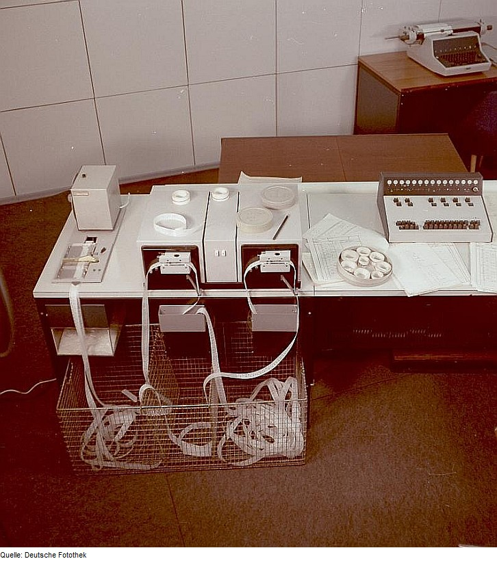

## How dose Scheme-langserver synchronizing?

Indexing is responsible for the core features of scheme-langserver, and multi-threads play the most important role speeding it up. Although according to the official guide book [csug 9.5](https://cisco.github.io/ChezScheme/csug9.5), Chez Scheme provided a thread-system: 
> With the exception of locks, locked increment, and locked decrement, the features of the thread system are implemented on top of the Posix thread system (pthreads) on non-Windows-based system and directly using the Windows API on Windows-based systems.  Consult the appropriate documentation on your system for basic details of thread creation and interaction.

This is especially exhausting, because in practice, the synchronizing mechanism is not only for runtime controlled with the control structures, but also for program coding by the design of APIs. "Unfortunately", Scheme and many other Lisp dialects have extreme flexible control structures. For this cause, corresponding open-source implementation is truly rare. For example, you can hardly find any reader-writer-lock implementation in Scheme as in C++ for you may not even know which process in your program is locked.

As like tape computer, a non-parallel mechanism view is that this machine rolls the tape in and out. With a `loop` program, the rolling trick may stop until the tape has been drilled enough holes for pre-defined conditions. This whole ahead-back process is called a continuation, and many Lisp programmers just coding with this so-called "continuation-passing style". Apparently, they're supposed to write static codes (maybe on a tape's former part, lol) and dynamically produce more other codes (maybe on the last tape's latter part). And this truly raise parallel model a big problem: how these tapes communicate? Can we avoid twists and knots? Especially for `call/cc`, it would act like harshly drag a tape from a running machine and stick it into another machine if it involved some competitive data in different threads.

This document will describe what Scheme-langserver did with [synchronize.sls](../../util/synchronize.sls).

### What does Scheme-langserver hope synchronizing to do?
1. To analyze static codes parallel, for rules catching identifiers.
2. To respond API requests sequentially. 
3. Schedule requests and optimize API responses. As [this page](https://microsoft.github.io/language-server-protocol/specifications/lsp/3.17/specification/#dollarRequests) and [this page](https://microsoft.github.io/language-server-protocol/specifications/lsp/3.17/specification/#messageOrdering) said, many times we may cancel some requests with editor or by some API semantic definition. A peephole optimization should be applied. This is specifically useful for [LunarVim](https://www.lunarvim.org/) and some other editors' document synchronizing, for they always produce several `TextDocument/didChange` reducible requests.

### What mechanism dose Scheme-langserver implement?
Scheme-langserver is supposed to receive requests sequentially but response parallelly. This means all edit operations are mostly about read and write index. And apparently, every write operations occurred sequential with such read interleaving. In addition, multi-threads should be involved at tiller data nodes(like [index-node.sls](../../virtual-file-system/index-node.sls)). And the following mechanisms are what we're using:
1. Thread pool with [ufo-thread-pool](https://github.com/ufo5260987423/ufo-thread-pool);
2. Threaded functions with [ufo-threaded-functions](https://github.com/ufo5260987423/ufo-threaded-function);

### Why doesn't Scheme-langserver Use Reader-writer-lock?
As everyone known, reader-writer lock perform following properties. And these make it unlike the other 3 mechanisms, it should be carefully handled to avoid nested locking and many other things.

| Status     | Read Request | Write Request |
|------------|--------------|---------------|
| None       | Permit       | Permit        |
| Has Reader | Permit       | Block         |
| Has Writer | Block        | Block         |

Someone supposes scheme-language that [workspace.sls](../../analysis/workspace.sls) and [document.sls](../../virtual-file-system/document.sls) provide `with-(workspace/document/documents)-(read/write)` syntax to assure above reader-writer-lock's properties. A common situation here is that APIs like `textDocument/didChange` and `textDocument/completion` may not disturb with each other in [scheme-langserver.sls](../../scheme-langserver.sls), but they may conflict in [document.sls](../../virtual-file-system/document.sls) and the situation is much more difficult and exceed the ability of reader-writer-lock.

Because reader-writer-lock actually suppose that requests should be response parallelly as in many web APPs. It's not trivial, as [this page](https://microsoft.github.io/language-server-protocol/specifications/lsp/3.17/specification/#dollarRequests) indicated.

### Parallel Identifier Catching
With [shrinker.sls](../../analysis/dependency/shrinker.sls), identifier catching is divided into several batches. This means in [workspace.sls](../../analysis/workspace.sls), `threaded-map` can easily speed up working.